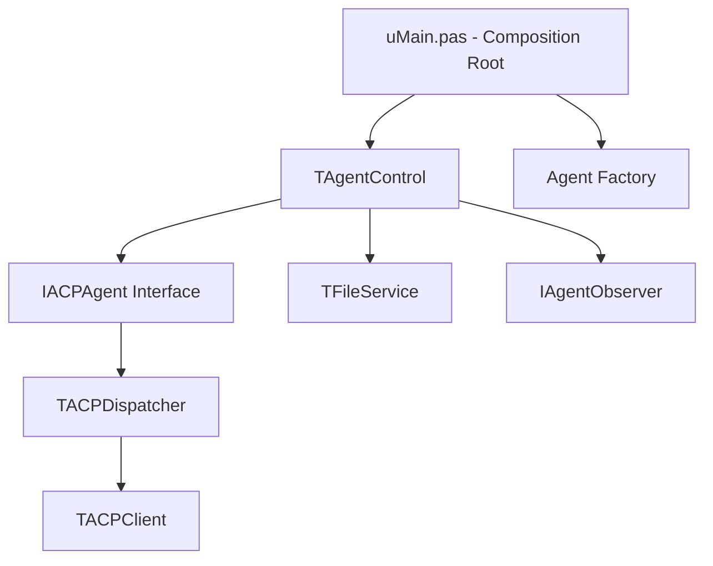

# Structural Refactoring Final Report (SOC v1 - v18)

이 문서는 ACP Agent Manager 프로젝트의 관심사 분리(SOC) 및 아키텍처 현대화 작업의 최종 결과를 기록합니다.

## 1. 개요 (Objective)
기존의 강결합된 모놀리식 구조를 탈피하여, 확장성과 유지보수성이 뛰어난 **계층형 아키텍처(Layered Architecture)**로 전환하는 것을 목표로 하였습니다. 특히 델파이(Back-end)와 HTML/JS(Front-end) 간의 통신 안정성 및 에이전트 다형성 확보에 집중했습니다.

## 2. 핵심 아키텍처 원칙
작업 과정에서 정립된 프로젝트의 표준 개발 원칙입니다.

1. **관심사 분리 (Separation of Concerns)**:
   - **View**: FMX Form 및 순수 마크업 중심의 HTML. 로직 배제.
   - **Presenter (Control)**: 브라우저와 서비스를 잇는 메신저 역할. 비즈니스 로직을 직접 수행하지 않음.
   - **Service/Dispatcher**: 파일 I/O, 네트워크 통신 등 무거운 비동기 작업을 전담.
   - **Core/Agent**: ACP 프로토콜 준수 및 각 에이전트별 특화 비즈니스 로직.

2. **의존성 역전 (Dependency Inversion)**:
   - 컨트롤러(`TAgentControl`)는 구체적인 에이전트 클래스(`TGeminiAgent`)를 알지 못하며, 인터페이스(`IACPAgent`)와 팩토리(Factory)를 통해서만 협업합니다.

3. **비동기 콜백 패턴 (Async Callback)**:
   - 모든 외부 리소스 접근은 성공/실패 콜백 기반으로 동작하며, UI 업데이트는 항상 메인 스레드 안전성을 보장(`TThread.Queue`)합니다.

## 3. 주요 리팩토링 단계별 성과

### Phase 1: 기반 아키텍처 수립 (v1 - v10)
- 세션 격리(Session Isolation) 및 캡슐화 적용.
- `TWebACPCommandHandler` 도입으로 URL 기반 명령어 파싱 구조화.
- 하이브리드 UI 통신용 Base64 인코딩 표준화.

### Phase 2: 서비스 레이어 및 비동기화 (v11 - v13)
- `TDiffService`, `TFileService` 도입으로 파일 시스템 로직 분리.
- 탐색기(Explorer)의 비동기화 및 HTML/JS 완전 분리 달성.

### Phase 3: 에이전트 다형성 및 이벤트 통합 (v14 - v15)
- `IAgentObserver` 인터페이스를 통한 이벤트 채널 단일화 (관찰자 패턴).
- 에이전트 부모 클래스(`TACPAgent`)에 가상 메서드 도입 및 하드코딩된 타입 캐스팅 제거.

### Phase 4: 프로토콜 분리 및 세션 생명주기 (v16 - v18)
- `TACPDispatcher`를 통한 JSON-RPC 핸드셰이크(Initialize/New/Load) 캡슐화.
- 인터페이스 기반의 **에이전트 팩토리(Factory)** 도입으로 완벽한 의존성 분리 달성.
- `JsonDataObjects`의 복사 버그를 해결하는 안정적인 통신 레이어 구축.

## 4. 최종 컴포넌트 구조도

## 5. 기대 효과
- **확장성**: 새로운 에이전트(Claude, OpenAI 등) 추가 시 컨트롤러 수정 없이 팩토리 주입만으로 대응 가능.
- **안정성**: 통신 스레드 보호 및 안전한 메모리 관리를 통해 에러 발생 시 프로그램 먹통 현상 방지.
- **가독성**: 각 유닛이 300~800라인 내외의 명확한 책임을 가진 코드로 정리됨.

---
**Status**: Completed (2026-04-26)
**Standard**: SOC v18 Compliance
