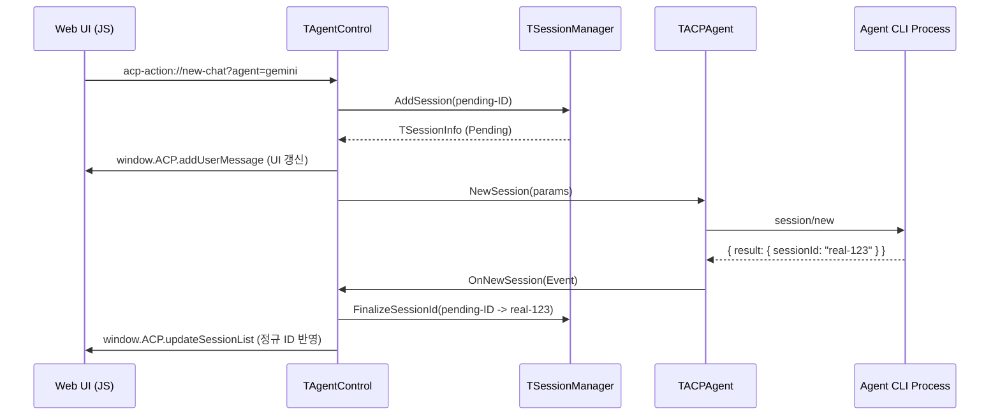
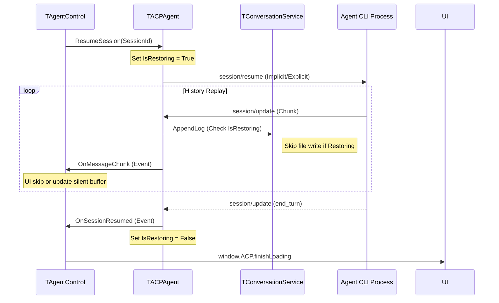
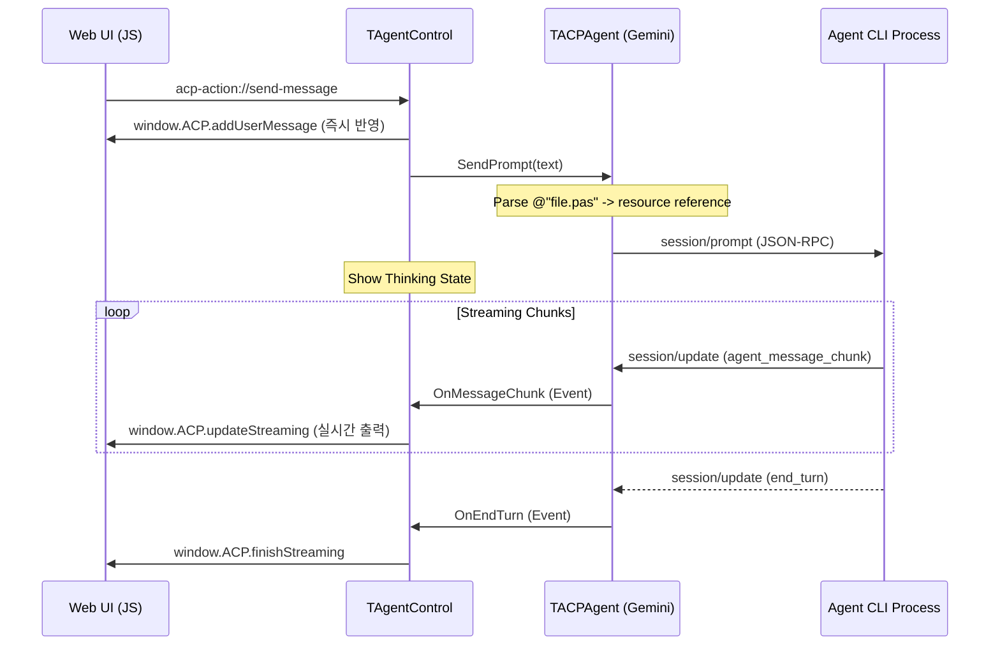

# ACP CLI Manager Sequence Diagrams (SOC v8)

이 문서는 에이전트와 UI 간의 핵심 인터랙션 흐름을 시각화합니다.

## 1. New Session (채팅 생성 흐름)
새 채팅 생성 시 사용자 응답성을 위해 임시 ID를 먼저 생성하고, 실제 프로세스 응답 시 정규 ID로 전환하는 과정을 보여줍니다.

## 2. Resume Session (세션 복구 흐름)
기존 로그 이력을 불러올 때 중복 기록을 방지하기 위한 `IsRestoring` 플래그 관리 흐름입니다.

## 3. Send Prompt (메시지 전송 및 스트리밍)
사용자 입력 파싱부터 실시간 응답 스트리밍까지의 흐름입니다.

## 핵심 설계 특징
1.  **Asynchronous ID Finalization**: `pending-` 접두어를 통해 네트워크 지연 중에도 UI가 멈추지 않도록 설계됨.
2.  **Stateless Agent**: 에이전트는 상태를 이벤트를 통해 전파하며, UI 계층(`TAgentControl`)이 최종적인 화면 표현(JS)을 결정함.
3.  **Restoration Protection**: `IsRestoring` 상태를 통해 세션 복구 시 로그 파일이 오염되는 것을 원천 차단함.
